# Shadowserver Report Ingestion & Intelligence Toolkit

**Author:** [Ike Owuraku Amponsah](https://www.linkedin.com/in/iowuraku)  
**Contributors:** [KeCIRT](https://ke-cirt.go.ke/)  
**License:** [MIT (Modified – No Resale)](https://github.com/anonghosty/shadowserver_email_automation/blob/main/LICENSE)

---

## Here I Show Appreciation For My Development in Critical Thinking

This toolkit is a dedication to my mentors Kwadwo Osafo-Maafo(Ghana) and Spilker Wiredu(Ghana), my brother from another country Mark Kilizo(Kenya). 
They made the impossible actually possible and gave me so much focus to bring this to reality. Also shoutout to DeepDarkCTI!!

---

## 📚 Table of Contents

```{toctree}
:maxdepth: 2
:caption: Documentation

System Requirements <02_system-requirements.md>
Installation & Bootstrapping <03_installation-and-environment-bootstrapping.md>
Environment Configuration <04_environment-configuration.md>
Report Ingestion Flow <05_shadowserver-report-ingestion-usage-and-flow.md>
Metadata Scraper <06_shadowserver-report-metadata-scraper.md>
Org-Based Report Generator <07_organization‐based-shadowserver-report-generator.md>
Analytics Dashboard <08_portable-analytics-dashboard.md>
Some Interesting Findings <09_crazy_techy_mode.md>
```
---

## 📌 Overview

This project automates the ingestion, parsing, categorization, and reporting of threat intelligence feeds from [Shadowserver](https://www.shadowserver.org/). It is built for CSIRT teams and analysts looking to streamline Shadowserver report handling and transformation into actionable intelligence.

---
## Professional Contributors

This section acknowledges the institutional input and guidance received during the resolution and mitigation issues.

1. **National CIRT of Kenya**  
   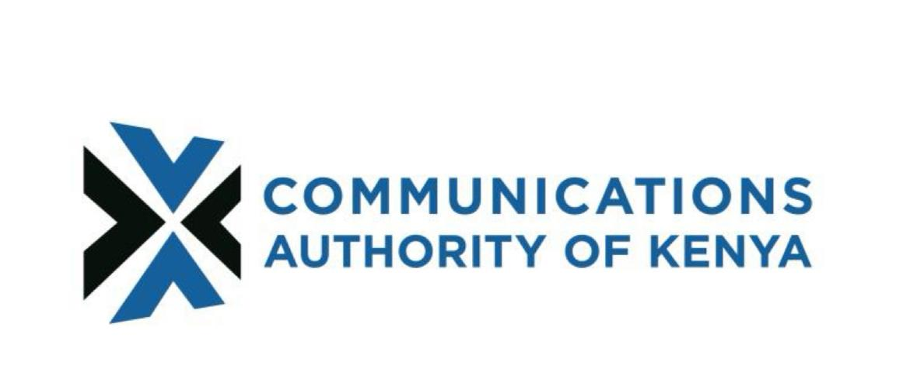  
   **Contribution:** Provided official communication (cirt@ke-cirt.go.ke), technical mitigation steps (0365 – Microsoft Graph, Google Workspace), and tutorial documentation (PDF format).
   **Update** On August 3rd, the KeCIRT team conducted a dedicated troubleshooting session to address persistent issues related to the graph option. After a comprehensive review and collaborative debugging, the underlying bugs were successfully identified and resolved. The graph functionality is now fully operational and performing as expected.

---
## 🚀 Key Features

- Email attachment ingestion (IMAP Authentication,Microsoft Graph Authentication, Google Workspace Oauth Authentication[Coming Soon])

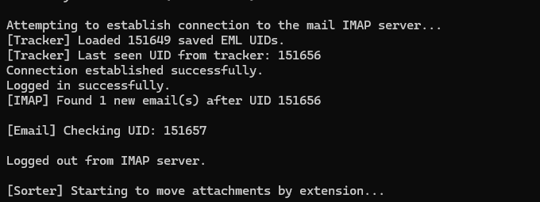

- ZIP, RAR, and 7z archive extraction

(Directory Sample)

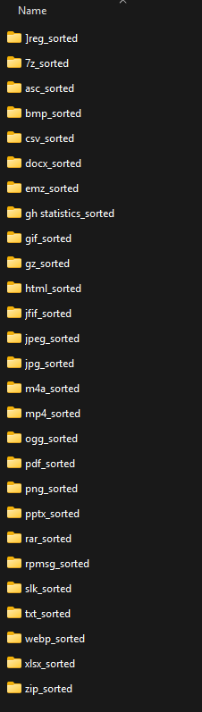

- CSV parsing, validation, and enrichment (IP, ASN, WHOIS)

(Folder Samples)

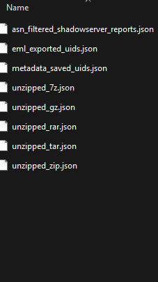

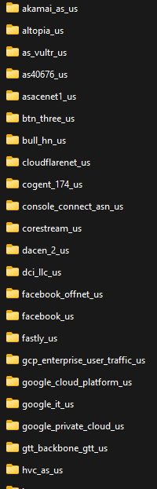

- Country and service-based categorization

(Folder Samples)

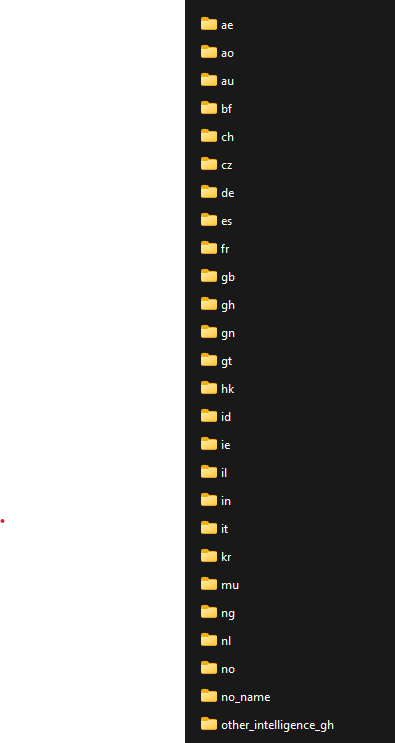

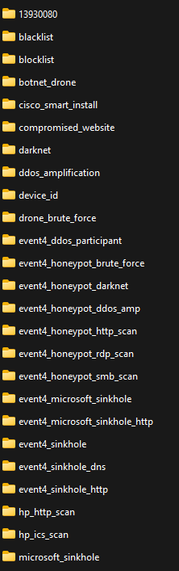


- 3 flavored variations for report generation daily - CSV {can be used in automation}, PDFs {can be be used in official reporting also added threatmap reports for visualisation of malicious communication }, HTML {has charts and search bars}

(Report Output Samples)

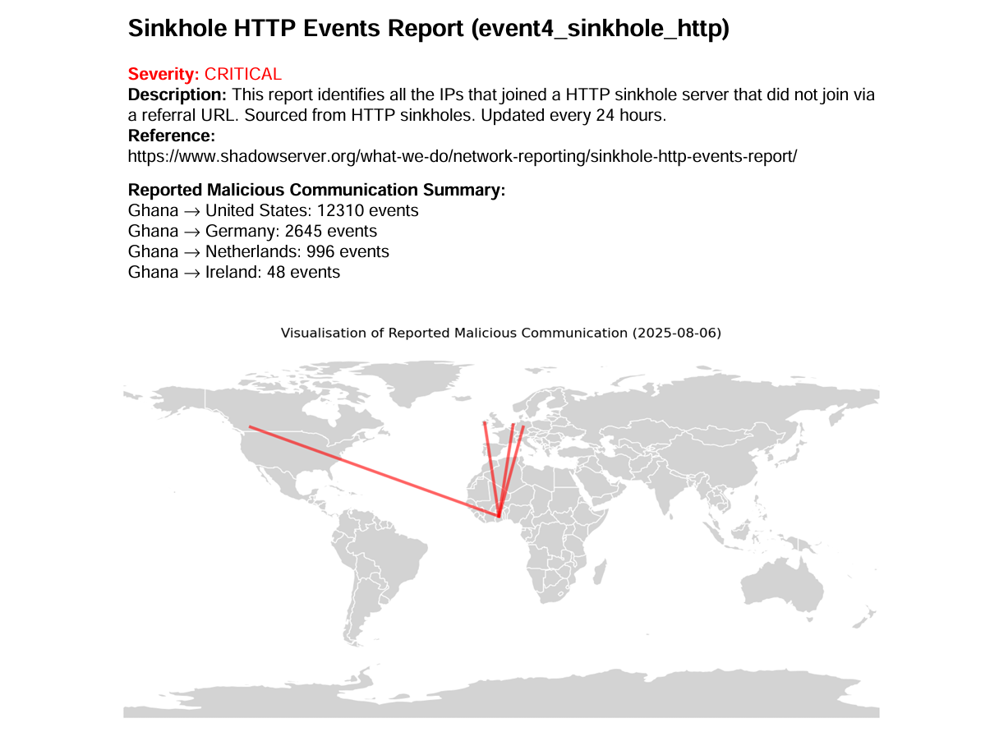

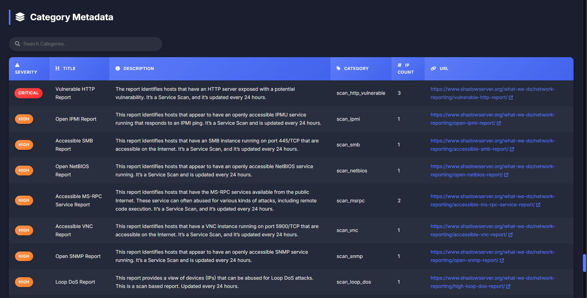

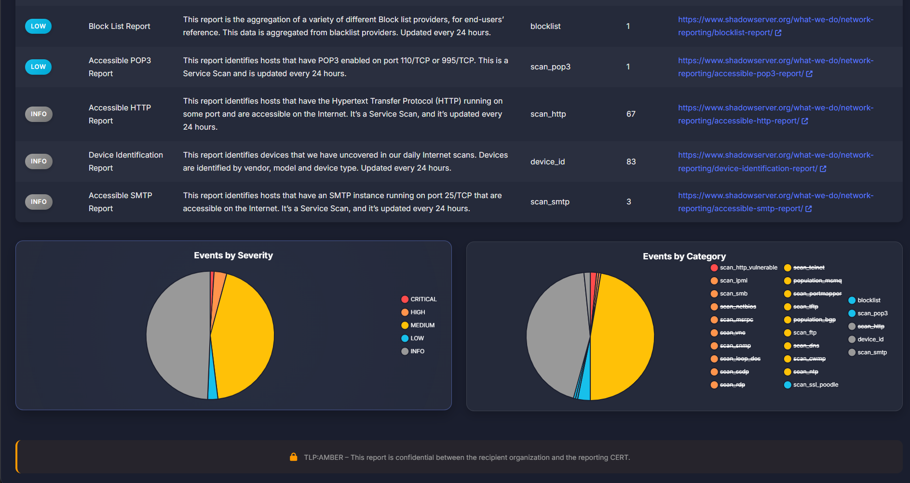

- MongoDB-based enrichment and storage
  
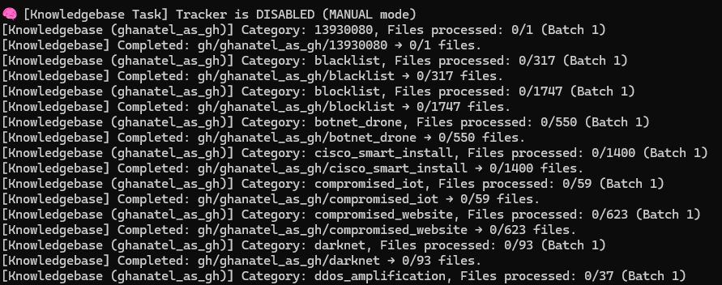

- Metadata scraping using Selenium + Chrome
  
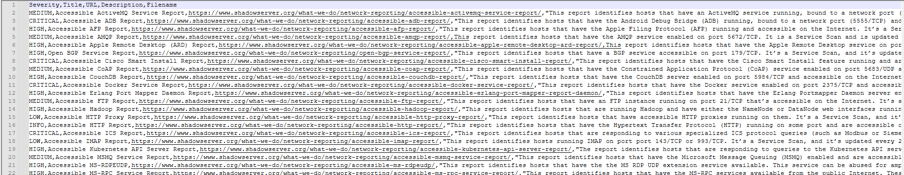

- Portable Dashboard Showcasing Trends and Bar Charts For Organisation,Date and Category Comparisons

(Dashboard Sample)


*Update*: The trend color logic for the Change field has been corrected. A decrease in value (negative change) is now appropriately displayed in green, while an increase in value (positive change) is shown in red, aligning with standard risk and anomaly indicators.

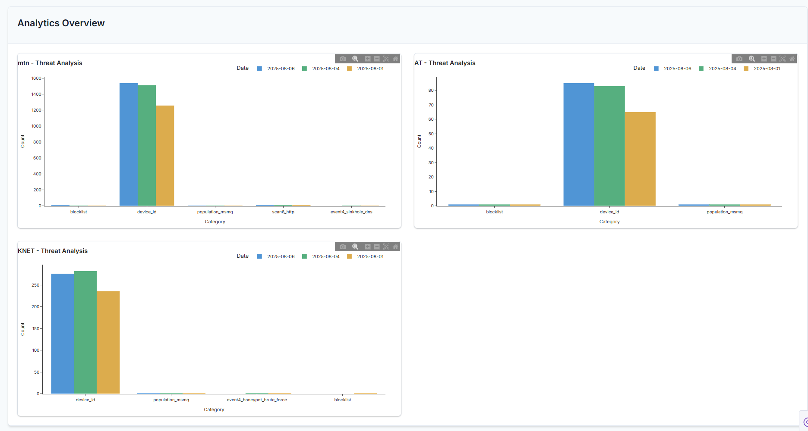

---


## 📬 Feedback & Contributions

If you're a CSIRT team or security analyst interested in collaborating or providing feedback, feel free to reach out via [LinkedIn](https://www.linkedin.com/in/iowuraku) or email me at (iassistuontoolkits@gmail.com).

