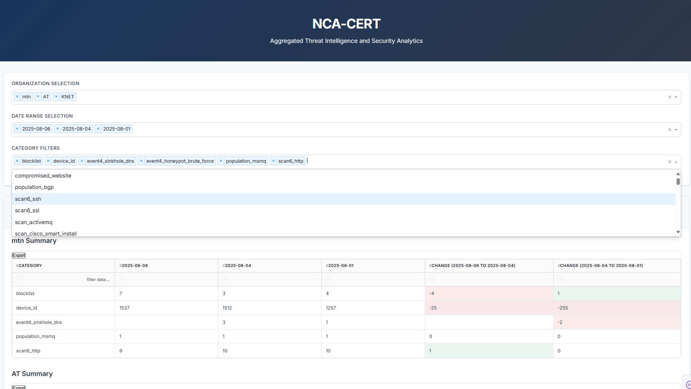

# Shadowserver Report Ingestion & Intelligence Toolkit

**Author:** [Ike Owuraku Amponsah](https://www.linkedin.com/in/iowuraku)  
**Contributors:** [KeCIRT](https://ke-cirt.go.ke/)  
**License:** [MIT (Modified – No Resale)](https://github.com/anonghosty/shadowserver_email_automation/blob/main/LICENSE)

---

## 📌 Overview

This project automates the ingestion, parsing, categorization, and reporting of threat intelligence feeds from [Shadowserver](https://www.shadowserver.org/). It is built for CSIRT teams and analysts looking to streamline Shadowserver report handling and transformation into actionable intelligence.

---
## Professional Contributors

This section acknowledges the institutional input and guidance received during the resolution and mitigation issues.

1. **National CIRT of Kenya**  
     
   **Contribution:** Provided official communication (cirt@ke-cirt.go.ke), technical mitigation steps (0365 – Microsoft Graph, Google Workspace), and tutorial documentation (PDF format).
   **Update** On August 3rd, the KeCIRT team conducted a dedicated troubleshooting session to address persistent issues related to the graph option. After a comprehensive review and collaborative debugging, the underlying bugs were successfully identified and resolved. The graph functionality is now fully operational and performing as expected.

---
## 🚀 Key Features

- Email attachment ingestion (IMAP Authentication,Microsoft Graph Authentication, Google Workspace Oauth Authentication[Coming Soon])

- ZIP, RAR, and 7z archive extraction

- CSV parsing, validation, and enrichment (IP, ASN, WHOIS)

  
- Country and service-based categorization

- 3 flavored variations for report generation daily - CSV {can be used in automation}, PDF {can be be used in official reporting}, HTML {has charts and search bars}

- MongoDB-based enrichment and storage

- Metadata scraping using Selenium + Chrome

- Portable Dashboard Showcasing Trends and Bar Charts For Organisation,Date and Category Comparisons

---

## 📬 Feedback & Contributions

If you're a CSIRT team or security analyst interested in collaborating or providing feedback, feel free to reach out via [LinkedIn](https://www.linkedin.com/in/iowuraku) or email me at (iassistuontoolkits@gmail.com).

